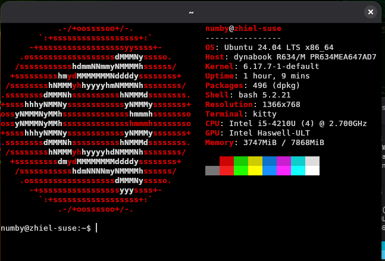
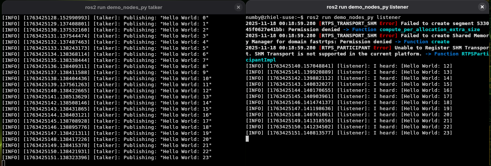

# Ubuntu Chroot Setup

In a normal Linux system, there is one kernel and one userspace. By default, your Linux distribution uses a single kernel to control all hardware, and a single userspace that runs everything else.
With that in mind, a chroot lets you add another userspace. Imagine operating as root on the same kernel, but inside a different directory.

The same kernel runs both environments, so both can access hardware resources. However, (unless there are security bugs) the nested chroot cannot access the primary filesystem. It has its own /etc for configuration, its own /lib for libraries, and its own /bin and /usr/bin for programs.

Inside a chroot, you can still access hardware. But if you do something like formatting /dev/sda1 from inside the chroot, you are modifying your real disk.

Based on this concept, you can run another Linux userspace without losing performance due to layering, limitations, or virtualization.

Since we only want to install an Ubuntu system, debootstrap will help set up the chroot. You can implement this on any Linux distro, but this guide focuses only on the current setup.

## Install debootstrap

```bash
sudo zypper in debootstrap
```
It is also available on other distributions like pacman (Arch), apt (Debian), or dnf (Fedora), etc.

## Create chroot environment

```bash
mkdir -p ~/SANDBOX/Noble #my custom name, you can put wathever you want
cd ~/SANDBOX
sudo -s
export MY_CHROOT=$PWD/Noble
debootstrap --arch=amd64 noble $MY_CHROOT http://archive.ubuntu.com/ubuntu/
```

Wait for the download to complete while enjoying your coffee.

Now you have an Ubuntu Noble system inside your chroot directory.

Next, we need to set up processes, system input, hosts, etc. Make sure you're still in the same shell, as root.

## Setup system mounts

```bash
echo "proc $MY_CHROOT/proc proc defaults 0 0" >> /etc/fstab
mount proc $MY_CHROOT/proc -t proc
echo "sysfs $MY_CHROOT/sys sysfs defaults 0 0" >> /etc/fstab
mount sysfs $MY_CHROOT/sys -t sysfs
cp /etc/hosts $MY_CHROOT/etc/hosts
cp /proc/mounts $MY_CHROOT/etc/mtab
```

Exit from root shell:

```bash
exit
```

# Enter chroot

```bash
sudo chroot Noble
```

## Add user

```bash
adduser numby
usermod -aG sudo numby
```

## Fix sources list

Update:

```bash
apt update && apt install nano
```

```bash
nano /etc/apt/sources.list
```

This is my list:

```
deb http://archive.ubuntu.com/ubuntu noble main restricted multiverse universe
```

## Install packages

```bash
apt update && apt install neofetch kitty
```

## Automatically login as user (inside chroot)
To automatically enter the chroot as user numby, edit the bashrc:
```bash
nano ~/.bashrc 
```


Then add this at the bottom:
```
su numby
```

After editing your ~/.bashrc, exit the chroot and re-enter—this time you'll automatically be logged in as user numby. When you're ready to leave, you'll need to type `exit` once to leave the numby session, and once again to exit from root.

# Ricing Up
Now we already have our chroot set. But we will try to make it better


## Mount additional filesystems for X11 and stuff (outside chroot)

From the host system:

```bash
export MY_CHROOT=$PWD/Noble
mount -t tmpfs tmpfs $MY_CHROOT/tmp
mount --bind /dev $MY_CHROOT/dev
mount --bind /dev/pts $MY_CHROOT/dev/pts
```

There is a lot of discussion about these mount types. Simply put:
Binding /dev allows the chroot to use devices. Since it is a bind mount, deleting files under /dev in the chroot will also affect the host. But don’t worry, after a reboot, /dev is regenerated by the kernel. The -t option creates new mountpoints and has no effect on the host.

Since you want  to play arround with this chroot for a while, you maybe want o make these mounts persistent during reboot, add them to `/etc/fstab`:

```bash
echo "tmpfs $MY_CHROOT/tmp tmpfs defaults 0 0" >> /etc/fstab
echo "/dev $MY_CHROOT/dev none bind 0 0" >> /etc/fstab
echo "/dev/pts $MY_CHROOT/dev/pts none bind 0 0" >> /etc/fstab
```


Add X11 access:

```bash
mkdir $MY_CHROOT/tmp/.X11-unix
mount --bind /tmp/.X11-unix $MY_CHROOT/tmp/.X11-unix
echo "/tmp/.X11-unix $MY_CHROOT/tmp/.X11-unix none bind 0 0" >> /etc/fstab
```


## Install X server (inside chroot)

```bash
sudo apt-get install -y xserver-xorg x11-apps

```

## Launching chroot with X11 access, dont  use root
From host system
```bash
xhost +LOCAL:
sudo chroot Noble
```

Open GUI app (inside chroot)

```bash
export DISPLAY=:0 
xeyes
```

You can add this on the numby bashrc, so no need to export display for every chrooting
```bash
export DISPLAY=:0 
neofetch 
cd /home/numby
```

You can add an additional mount point if you want to edit the code from the chroot but with the host's VSCode. You can bind-mount your project directory before entering the chroot:

```bash
sudo mount --bind ~/SANDBOX/Noble/home/numby/ ~/Dev/numby/
```

To make this mount persistent after reboot, add it to `/etc/fstab` as root:

```bash
echo "~/SANDBOX/Noble/home/numby/ ~/Dev/numby/ none bind 0 0" | sudo tee -a /etc/fstab
```

Is it easy right? Now you can create the small bash script to launch your chroot
```bash
xhost +LOCAL:
sudo chroot ~/SANDBOX/Noble
```

Then you can launch its own terminal, like Kitty, so it will be the only chroot terminal, separate from the host system



So now we can run ROS on OpenSuse :). You can install ROS inside this chroot following ROS official documentation.





If you want to get rid of this chroot, first remove its mount entries manually from /etc/fstab. After that, unmount all the filesystems you mounted inside the chroot, and then simply delete the chroot directory.